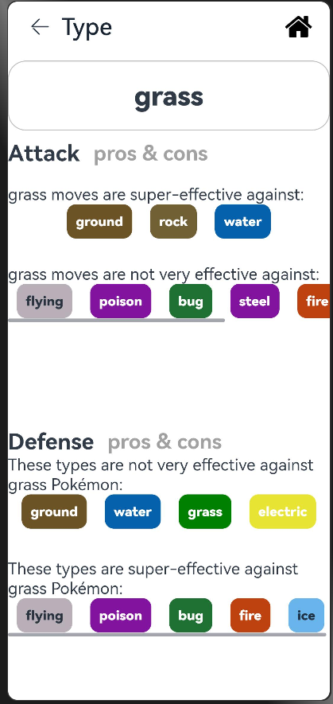

# PokemonList

## Introduction 
`Pokemon Book` is a Pokémon type and attribute details viewing tool that helps users quickly understand Pokémon's attribute restraint relationships, skill effects, and related data.


## Overview




This is a documentation lists all the problems or noticeable thing during the app development.
### Table of content

[Time difference of asynchronous data loading](#time-difference-of-asynchronous-data-loading)  
[How to properly encapsulate Json data](#how-to-properly-encapsulate-json-data)  
[Encapsulate nested JSON data structure](#encapsulate-nested-json-data-structure)  
[Intercept part of the data in the URL](#intercept-part-of-the-data-in-the-url)  
[The list data rendered by forEach is undefined](#the-list-data-rendered-by-foreach-is-undefined)  
##  Time difference of asynchronous data loading

#### Problem Background
This is a relatively troublesome problem because it involves the time difference of data rendering. For example, when I render the `Index` page, the list has not been rendered yet, and we access the unrendered Pokémon unit to get the `type`, which results in an error

(The problem encountered is caused by the time difference between asynchronous loading and rendering. When the data has not been fully loaded, the code tries to access undefined properties, resulting in a compilation error "Object is possibly 'undefined'.")
#### Solution
We must ensure the order of asynchronous operations. Use `Promise` or `async/await` to ensure that all data is loaded before performing subsequent operations. For example, `Promise.all` can be used to handle multiple asynchronous calls.

The general logic is as follows:
```typescript
        const list = await source.getPokemonList();
        this.pokeList = list;
        // Get the type of each Pokémon and store it in typeList
        const infoPromises = this.pokeList.map((item, index) =>
        source.getPokemonType(index).then((types) => {
          this.typeList[index] = types; // Store type array into two-dimensional array typeList
        })
        );

        await Promise.all(infoPromises); // Wait for all asynchronous tasks to complete
```


##  How to properly encapsulate Json data
#### Problem Background
Unable to parse the requested `Http Get` JSON data when writing the `DataSource` data source.

#### Solution
We need to design `model` or `interface` reasonably to make requests, and further split according to the model structure of the request
```typescript
  async getTypeDetail(url: string): Promise<DamageRelations> {
    return new Promise<DamageRelations>((resolve, reject) => {
      let httpRequest = http.createHttp()
      httpRequest.request(`${url}`, (err, data) => {
        if (!err) {
          try {
            // parse requested JSON data and receive with designed model
            let responseData: PokemonTypeData = JSON.parse(data.result as string)
            const res: DamageRelations = responseData.damage_relations
            resolve(res)
          } catch (parseErr) {
            console.error('JSON Parse Error', parseErr);
            reject(err);
          }
        } else {
          console.error('HTTP Error:', err);
          reject(err);
        }
      })
    })
  }
```
Taking the above example, after we call `http.createHttp()`, we need a suitable data type to receive the parsed data. `PokemonTypeData` in the above example is

In addition, each split structure must be reasonably encapsulated before use

##  Encapsulate nested JSON data structure
To solve this problem, a recursive function is used

```typescript
this.evolutionSpecies = this.extractSpeciesNames(this.pokeEvolution.chain as EvolutionChain)

  // Recursive method to extract species names
  extractSpeciesNames(chain: EvolutionChain, result: Species[] = []): Species[] {
    result.push({
      name: chain.species.name,
      url: chain.species.url
    });
    chain.evolves_to.forEach((nextChain) => {
      this.extractSpeciesNames(nextChain, result);
    });
    return result;
  }
```


## Intercept part of the data in the URL
#### Problem Description
In some special cases, we need to intercept a part of a string in a specific format. In this example, we need to intercept the last number of `url`

#### Solution
```typescript
function extractLastNumber(url: string): number {
  const parts = url.split('/').filter((part) => part !== ''); // Split by slash and filter out empty strings
  const lastPart = parts[parts.length - 1]; // Get the last part
  return parseInt(lastPart, 10); // Convert to a number and back
}
```

## The list data rendered by forEach is undefined
Directly accessing asynchronously updated values ​​inside forEach may result in inconsistent data state. You can use a for loop to process them one by one instead.
```typescript
if (Array.isArray(this.effectEntry))
for(const item of this.effectEntry){
    if (item.language?.name === 'en') {
    this.effectInfo.language = item.language;
    this.effectInfo.short_effect = item.short_effect;
    break;
    }
}
```
